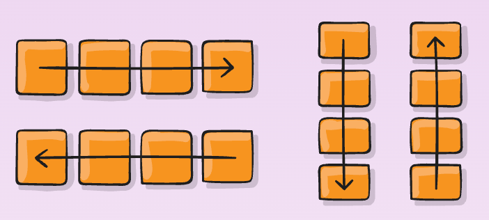
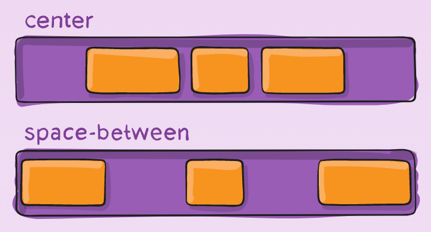

# Intro to React Native

Adapted from [Orbital Workshop 2023](https://github.com/yadunut/orbital-react-native-2023/blob/main/slides/part1.md)

## About Me

- Justin Cheah Yun Fei
- Y2 NUS CS + BBA
- NUS Hackers coreteam member
- Used React Native for my Orbital 2023 project - [SoulScribe](https://tinyurl.com/soulscribeai)
- Created Minimum Viable Products (MVPs) for a few startups using React Native

  

## Overview

### Part 1

- A bit about React Native
- Setting up React Native + simulator
- Creating UI with React Native (JSX Components)
- Creating logic with React Native (React hooks, basic Javascript)
- Styling UI with React Native
- Organizing files and code with React Native
- Prompt engineering + google tricks for React Native

### Part 2

- Create multiple screens (Routing)
- When and how to use libraries

## Setting expectations

- This workshop will focus on concepts rather than processes
- This course will assume that you are a beginner, though I will make reference to other concepts like `React` or `CSS` without delving too deep into them
- There will (unfortunately) be some unfamiliar jargons and processes, especially when setting up. Don't think too much about them. They are easily google-able and even I have to google them every time despite having set up multiple projects.
- Goal of this workshop:
  > I know about this concept and what it does. I might not know how to do it yet, but I know roughly which direction to go to learn more about it.

## Format

- I will be going through some concepts with some real life demo

## What we will be building

[To be inserted]

## Why React Native?

- It is cross platform (Android and iOS phones can use my app)
- It is very similar to React (React is arguably the most popular framework for web development right now, skills can be easily transferrable between them)

## Setting up React Native (Expo)
> Expo is a set of tools and services built around React Native and, while it has many features, the most relevant feature for us right now is that it can get you writing a React Native app within minutes. You will only need a recent version of Node.js and a phone or emulator.

In other words, Expo abstracts away a lot of the nitty gritty details of dealing with React Native. You can focus on building the app instead of spending time on configurations.

### Setting up Expo Go

Follow the instructions [here](https://reactnative.dev/docs/environment-setup).

### Setting up Android emulator

Follow the instructions [here](https://docs.expo.dev/workflow/android-studio-emulator/).

## Getting started
1. Open the project in the IDE of your choice
2. Open a new terminal window
3. Run `npm run android` or `npm run ios` (note that only Mac users can use this command)
4. Try editing some text and see the changes in real time!

## Creating UI with React Native

Think of it as a tool that allows you to to create stuff with logic and UI. Since CS1101S (or any of the CS1010 variants) focuses mainly on logic, this might be the first time you are dealing with UI.

Normally, UI on the web is rendered with HTML. Likewise, we can create UI with HTML-like syntax.

### Common React Native Components
- `View`:
- `Text`:
- `Button`:
- `TouchableOpacity`: 
- `TextInput`:

You can read up on other components [here](https://reactnative.dev/docs/components-and-apis).

### Organizing Components
Components can be organized using [flex box](https://css-tricks.com/snippets/css/a-guide-to-flexbox/). Understanding the 4 concepts below can meet 90% of your needs. Later on we will try to create the mockup for NUS NextBUS using these concepts alone.

### Flex direction

- `row`: organize components horizontally
- `column`: organize components vertically

### Justify content

- `space-between`: Spread out components evenly. First component at the left end, last component at the end.
- `center`: Components are centered.

### Tips
- To visualise the container, change the background colour
### Recap of Javascript

### Intro to JSX

### React Native Components

[Demo some of the commonly used components like `Text`, `ScrollView`, `TextInput`, `Button`, `Image`]

## Creating logic with React Native

Components can have the business logic, as well as the code to create the UI.

### React hooks

Two of the most commonly used hooks are `useState` and `useEffect` (not the scope of this workshop)

[Quick demo on useState to create counter]

## Styling

The current design looks ugly. You can create styles (change the colour, size etc.) of the UI using `StyleSheet` or `Nativewind` (Tailwind equivalent but not under the scope of this workshop)

## Design pages
- Go through different existing apps
